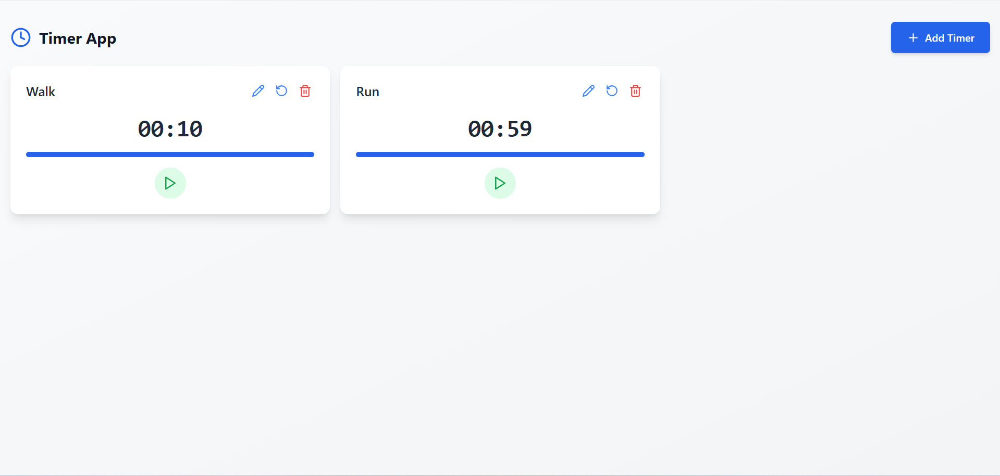
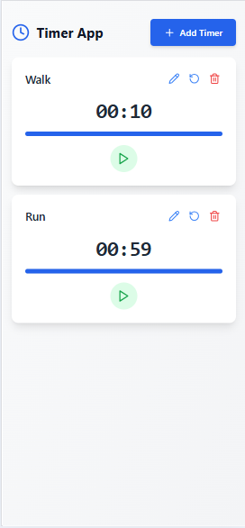

# **Timer App Assignment**

This Timer App is a React-based project enhanced with Vite, Tailwind CSS. The app allows users to manage multiple timers simultaneously, with added features like snack bar notifications, validation and persistent data storage.

## **Application Screenshots**

```bash
   Desktop View
```

```bash
   Mobile View
```

---

## **Key Features**
- Add multiple timers simultaneously
- Edit an existing timer
- Responsive design for both desktop and mobile screenshots
- Timers stay persistant after page reload using `localstorage`
- Validation with snackbar error messages


## **Future Implementation**
- Unit and component testing using `vitest`


## **Tech Stack**
- **Frontend Framework**: React, Redux, Zustand
- **Styling**: Tailwind CSS

## **Steps to run the project**

1. Clone the repository:  
   ```bash
   git clone https://github.com/Hemangshu-Dey/timer.git
   cd timer
   ```

2. Install dependencies:  
   ```bash
   npm install
   ```

3. Start the development server:  
   ```bash
   npm run dev
   ```
---


## **Deployment Link**
- You can find the deployed applicaion in the below link

https://timer-codewalnut.vercel.app/
---


